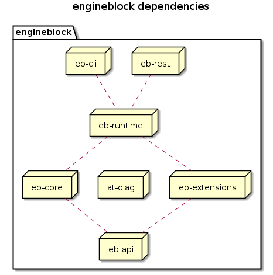

EngineBlock is packaged as a 
[Maven Reactor](https://maven.apache.org/guides/mini/guide-multiple-modules.html) project.

## Defaults and Dependencies

Maven reactor projects often confuse developers. In this document, we'll explain
the basic structure of the EngineBlock project and the reasons for it.

Firstly, there is a parent for each of the modules. In Maven parlance, you can
think of a parent project as a template for projects that reference it. One of
the reasons you would do this is to simply common build or dependency settings
across many maven projects or modules. That is exactly why we do that here. The
'parent' project for all EngineBlock modules is aptly named 'project-defaults',
as that is exactly what we use it for.

As well, there is a "root" project, which is simply the project at the project's
base directory. It pulls in the modules of the project explicitly as in:

~~~
    <modules>
        <module>project-defaults</module> <!-- Holds project level defaults -->
        <module>eb-api</module> <!-- APIs -->
        ...
    </modules>
~~~

This means that when you build the root project, it will build all the modules
included, but only after linearizing the build order around the inter-module
dependencies. This is an important detail, as it is often overlooked that this
is the purpose of a reactor-style project.

The dependencies between the modules is not implicit. Each module listed in the
root pom.xml has its own explicit dependencies to other modules in the project.
We could cause them to have a common set of dependencies by adding those
dependencies to the 'project-defaults' module, but this would mostly prevent us
from making the dependencies for each as lean and specific as we like. That is
why the dependencies in the project-default **parent** module are empty.

The project-defaults module does, however, have some build, locale, and project
identity settings. You can consider these cross-cutting aspects of the modules
in the project. If you want to put something in the project-default module, and
it is not strictly cross-cutting across the other modules, then don't. That's
how you keep thing sane.

To be clear, cross-cutting build behavior and per-module dependencies are two
separate axes of build management. Try to keep this in mind when thinking about
modular projects and it will help you stay sane. Violating this basic rule is
one of the most common mistakes that newer Maven users make when trying to
enable modularity.

## Intermodule Dependencies

Modularity at runtime is enabled via the
[ServiceLoader](https://docs.oracle.com/javase/8/docs/api/java/util/ServiceLoader.html).
The eb-core module uses the eb-api module to know the loadable activity types.
ActivityType implementations use the eb-api module to implement the loadable
activity types. In this way, they both depend on the eb-api module to provide
the common types needed for this to work.

The eb-runtime module allows the separate implementations of the core and the
activity type implementations to exist together in the same classpath. This goes
hand-in-hand with how the runtime jar is bundled. Said differently, the artifact
produced by eb-runtime is a bundling of the things it depends on as a single
application. eb-runtime consolidates dependencies and provides a proper place to
do integration testing.

Taking the API at the bottom, and the components that can be composed together
at the middle, and the bundling project at the top, you'll see a not-uncommon
project structure that looks like a diamond. Going from bottom to top, you can
think of it as API, implementation, and packaging.
